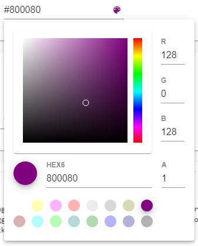
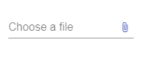

# Angular Material Extra Components (DatetimePicker, TimePicker, ColorPicker, FileInput ...) for @angular/material 7.x, 8.x, 9.x, 10.x, 11.x, 12.x, 13.x, 14.x, 15.x, 16.x

[](https://travis-ci.com/h2qutc/angular-material-components)
[](https://www.npmjs.com/package/angular-material-components)

## Description

Angular Material Library provide extra components for every project (Datetime picker, Time picker, Color picker...).

Please do not hesitate to contact us if you have any question or suggestion.

Feel free to open the [issues](https://github.com/h2qutc/angular-material-components/issues) or provide a PR.

If you like this project, support angular-material-components by starring⭐.

<a href="https://www.buymeacoffee.com/h2qutc" target="_blank"></a>

## DEMO Angular Material Components

@see [LIVE DEMO AND DOCUMENTATION](https://h2qutc.github.io/angular-material-components/)

Choose the version corresponding to your Angular version:

 Angular     | @angular-material-components/xxx (xxx is name of package(datetime-picker, color-picker, file-input))
 ----------- | -------------------
 10          | 4.x+              
 9           | 2.x+              
 8           | 2.x+              
 7           | 2.x+                 


### Datetime Picker

[](https://www.npmjs.com/package/@angular-material-components/datetime-picker)
[]()

[TUTORIAL HERE](https://h2qutc.github.io/angular-material-components/)

```
npm install --save  @angular-material-components/datetime-picker
```


@see [DEMO stackblitz for Angular 7, Angular 8](https://stackblitz.com/edit/demo-ngx-mat-datetime-picker)

@see [DEMO stackblitz for Angular 9](https://stackblitz.com/edit/demo-ngx-mat-datetime-picker-angular9)

### Color Picker

[](https://www.npmjs.com/package/@angular-material-components/color-picker)
[]()

[TUTORIAL HERE](https://h2qutc.github.io/angular-material-components/)

```
npm install --save  @angular-material-components/color-picker
```


@see [DEMO stackblitz](https://stackblitz.com/edit/demo-ngx-mat-color-picker)

### File Input

[](https://www.npmjs.com/package/@angular-material-components/file-input)
[]()

[TUTORIAL HERE](https://h2qutc.github.io/angular-material-components/)

```
npm install --save  @angular-material-components/file-input
```




### Theming
- @see @angular/material [Using a pre-built theme](https://material.angular.io/guide/theming#using-a-pre-built-theme)
- Add the Material Design icon font to your index.html
```
<link href="https://fonts.googleapis.com/icon?family=Material+Icons&display=block" rel="stylesheet">
```

## License
MIT
